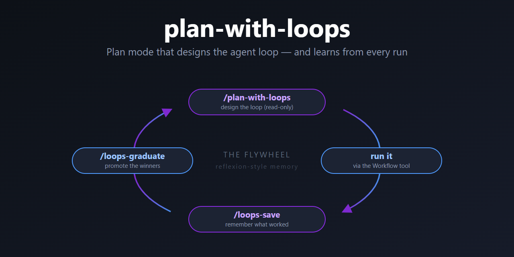

# 🌀 plan-with-loops

<p align="center">
  
</p>

**Plan mode for Claude Code that designs the *agent loop* — then gets smarter every time you run one.**

[](https://docs.claude.com/en/docs/claude-code)
[](LICENSE)
[](CONTRIBUTING.md)
[](#-help-make-it-better)

> Default Plan mode gives you a list of steps. **plan-with-loops** gives you the *orchestration*: which agents, running in parallel or in a pipeline, with what models, where the verification pass goes, when the loop stops — wired straight to Claude Code's native `Workflow` tool. And every loop you run feeds the next plan.

---

## Why this exists

Multi-agent work is easy to *start* and hard to *get right*. You spin up a fan-out, it burns 5× the tokens, half the agents do redundant work, nothing verifies anything, and the loop never quite terminates. Then next week you do it all again from scratch — none of last week's hard-won lessons carried over.

This is a **three-skill flywheel** that fixes both halves of that problem:

```
        ┌───────────────────────────────────────────────────────┐
        │                                                       │
        ▼                                                       │
  /plan-with-loops  ──►  you run the loop  ──►  /loops-save    │
   design the loop        (Workflow tool)        capture it ───┘
   (reads past runs)                             to memory
        ▲                                              │
        │                                              ▼
        │                                       /loops-graduate
        └──────── proven loops become ◄─────  promote the winners
                   their own skills            into first-class skills
```

1. **Plan smarter** — `plan-with-loops` designs the roster + loop topology for you, scaled to the effort you ask for, and **recalls your past runs** so it stops repeating mistakes.
2. **Remember what worked** — each run's facts are captured *automatically* at loop-end; `loops-save` stamps your verdict + the *why* onto it. Durable memory, no lost context.
3. **Crystallize the winners** — `loops-graduate` turns a loop that's proven itself into a brand-new reusable skill.

It's [Reflexion](https://arxiv.org/abs/2303.11366)-style long-term memory for your orchestration patterns — verbal lessons, not gradients.

---

## The three skills

| Skill | Trigger | What it does | Writes? |
|-------|---------|--------------|---------|
| 🧭 **plan-with-loops** | `/plan-with-loops [low\|medium\|high]` | Read-only planner. Produces a 4-part design doc: step plan → agent roster → loop topology → implementation wired to the `Workflow` tool. Recalls prior runs to bias the design. | ❌ Nothing — pure design doc |
| 💾 **loops-save** | `/loops-save` | Stamps the outcome + Reflexion lessons (what worked / what you'd change / what's reusable) onto the record the loop auto-wrote, and updates the *agent-type registry*. | ✅ `~/.claude/loops/` |
| 🎓 **loops-graduate** | `/loops-graduate` | Promotes a proven loop (`outcome: worked`, ideally repeated) into its own `~/.claude/skills/<name>/SKILL.md`. You are the gatekeeper. | ✅ A new skill file |

### What a plan looks like

`plan-with-loops` is **autonomous then approve** — it decides the roster and loop itself, then hands you one finished design to sign off on. No 20-question interview. Output template:

```
# Loop Plan: <task>  (effort: medium)

## 1. Plan
1. ... step breakdown ...

## 2. Agent roster
| Agent | Role | Model | Tools | Parallel? |
|-------|------|-------|-------|-----------|
| orchestrator | splits + merges | opus   | Read, Task        | —   |
| scanner      | finds candidates | sonnet | Read, Grep, Glob   | yes |
| verifier     | adversarial check | sonnet | Read              | yes |

## 3. Loop topology
- Controller: code-controlled (a Workflow script IS the orchestrator)
- Pattern(s): orchestrator-worker fan-out + one verify pass
- Termination: all candidates verified | Circuit breaker: ≤ 8 workers
- State: candidate list externalized to script scope
- Est. cost note: ~4× a single serial agent

## 4. Implementation (Claude Code native)
    phase('scan')
    const hits = await parallel(dirs.map(d => () => agent(`scan ${d}`, {schema, model:'sonnet'})))
    phase('verify')
    const ok = await pipeline(hits.flat(), verifyStage)
```

### Effort scales the orchestration

Complexity should match the ask — not every task wants a 12-agent swarm.

| Effort | Plan depth | Agents | Loop | Verification |
|--------|-----------|--------|------|--------------|
| **low** | a few coarse steps | **single agent** (prefer it — and it says so) | none / linear | none |
| **medium** | fine steps, key files | orchestrator + parallel workers | orchestrator-worker fan-out | one verify pass |
| **high** | full steps + trade-offs | orchestrator + diverse workers | evaluator-optimizer + adversarial/judge + loop-until-dry | N-skeptic / diverse-lens, externalized state |

The whole thing runs on a **cost-discipline** principle borrowed from Anthropic's agent guidance: *start with simple prompts, add complexity only when simpler solutions fall short.* At `low` effort it will actively tell you to just use one agent.

---

## Quickstart

### Install (manual)

Skills live in `~/.claude/skills/`. Copy the three folders in:

**macOS / Linux**
```bash
git clone https://github.com/tcf-jw/plan-with-loops.git
cd plan-with-loops
cp -r skills/plan-with-loops skills/loops-save skills/loops-graduate ~/.claude/skills/
```

**Windows (PowerShell)**
```powershell
git clone https://github.com/tcf-jw/plan-with-loops.git
cd plan-with-loops
Copy-Item -Recurse skills\plan-with-loops, skills\loops-save, skills\loops-graduate $HOME\.claude\skills\
```

Or run the bundled installer: `./install.sh` (bash) or `./install.ps1` (PowerShell).

Restart Claude Code (or start a new session) and the skills will be discovered automatically.

### Use it

```
/plan-with-loops high  audit this codebase for silent failures and propose fixes
```

→ Claude explores read-only, recalls any past audit loops, and hands you a full loop design. Approve it, then run it via the `Workflow` tool. When it's done:

```
/loops-save        # capture the run + lessons
```

And once that pattern has earned its keep across a few runs:

```
/loops-graduate    # promote it to its own skill, e.g. /silent-failure-audit
```

---

## How the loop is wired

These skills speak **Claude Code native**, not LangGraph or CrewAI. The design targets the `Workflow` tool's primitives:

- `agent(prompt, {schema, model, ...})` — spawn a subagent; with a `schema` it returns a validated object.
- `pipeline(items, stage1, stage2, …)` — each item flows through all stages independently, **no barrier**. The default for multi-stage work.
- `parallel(thunks)` — a **barrier**; use only when a stage genuinely needs *all* prior results.
- `phase()` / `log()` / `budget` — progress grouping, narration, budget-scaled loops.

…plus `.claude/agents/<name>.md` subagent files for reusable roles. The bundled [`reference.md`](skills/plan-with-loops/reference.md) is a full catalog: the canonical agent loop, who-controls-the-loop axis, Anthropic's 5 patterns mapped to Claude Code, the quality/verification loops (adversarial-verify, diverse-lens, judge-panel, loop-until-dry), and the mandatory termination + circuit-breaker rules. **Every loop is bounded — no unbounded swarms.**

---

## Memory: how the flywheel persists

Loop memory is **plain markdown** in `~/.claude/loops/` — zero dependencies, greppable, portable across machines. No database, no service to stand up.

Capture is **two-step, designed so context is never lost**:

1. **Auto (the facts).** Every loop `plan-with-loops` designs ends with a mandatory `capture` phase: a `recorder` agent writes `loop-record-<slug>-<date>.md` — task, roster, topology, results, token cost — the instant the run finishes, straight from the Workflow's own state. Even if you `/clear` immediately after, the facts are safe.
2. **Manual (the judgment).** Once you've evaluated the run, `/loops-save` stamps the part only a human can decide — `worked` / `partial` / `failed` plus the Reflexion lessons — onto that same record, and bumps the agent-type registry.

`plan-with-loops` reads those records on its next run (Phase 1.5) to bias the design toward what's worked before — and `loops-graduate` promotes the repeat winners.

**Optional vault backend.** The skills also detect the `query_vault` / `save_to_vault` MCP tools (an Obsidian-style vault) and mirror to them when present — but nothing requires it. Want a different backend (SQLite, a shared team store)? **Great first PR** — see below.

---

## 🛠️ Help make it better

This started as one person's workflow and it's deliberately public so others can poke holes in it. **Issues, ideas, and PRs are genuinely wanted.** Some directions that would be great:

- 🔌 **More memory backends** — markdown is the default; add SQLite, a shared team store, or deepen the optional vault mirror.
- 🧩 **More loop patterns** in `reference.md` — got a tournament bracket, a self-repair loop, a staged-escalation pattern that works? Add it.
- 📦 **Package as a Claude Code plugin** so it installs in one command.
- 🧪 **Real-world loop records** — share a `loop-record-*` that worked (or instructively failed); negative lessons are valuable too. See [`examples/`](examples/) for the format.
- 📝 Docs, examples, screenshots of a loop running.

Open an issue to float an idea, or just send a PR. See [CONTRIBUTING.md](CONTRIBUTING.md). No contribution is too small — even a typo fix or a "this confused me" issue helps.

If you build a cool loop with this, **I'd love to see it** — open a discussion or tag the repo.

---

## License

[MIT](LICENSE) — do whatever you like, attribution appreciated.

---

<sub>Built for [Claude Code](https://docs.claude.com/en/docs/claude-code). Loop-design catalog informed by Anthropic's agent-building guidance and the [Reflexion](https://arxiv.org/abs/2303.11366) framework.</sub>
